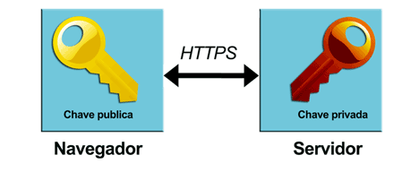
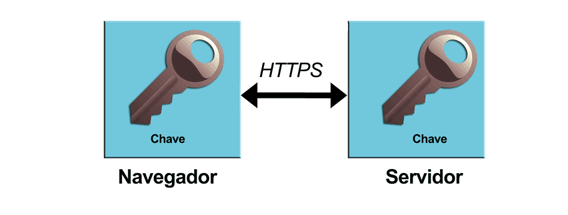

# A versão segura do HTTP

- [A versão segura do HTTP](#a-versão-segura-do-http)
  - [Enviando dados com HTTP](#enviando-dados-com-http)
  - [Funcionamento do HTTPS](#funcionamento-do-https)
    - [Por que HTTPS é seguro?](#por-que-https-é-seguro)
  - [Método de criptografia utilizado no HTTPS](#método-de-criptografia-utilizado-no-https)
    - [Criptografia assimétrica](#criptografia-assimétrica)
    - [Criptografia simétrica](#criptografia-simétrica)
    - [Como as criptografias se relacionam](#como-as-criptografias-se-relacionam)

## Enviando dados com HTTP

É o protocolo HTTP com uma camada de seguraça. Pois o HTTP sozinho, trafega texto puro para o servidor que pode ser visto por qualquer um. com o HTTPS há a camada SSL/TLS implementado.

## Funcionamento do HTTPS

Dados são enviados na requisição por meio de um certificado digital, que criptografa os dados e no tráfego até o servidor, ninguém conseguirá descriptografar a não ser que possua a chave privada, que somente o servidor possui (ou deveria possuir).

### Por que HTTPS é seguro?

O browser confia em entidades certificadoras específicas que cuidam de emitir este certificado de validação para os sites que querem implementar segurança no tráfego de dados utilizando o HTTPS.

Então ao invés de enviarmos texto puro nas requisições, estamos enviandos dados criptografados que o próprio servidor descriptografa (utilizando a chave pública do navegador em conjunto com a chave privada do servidor) para que as informações sejam lidas.

## Método de criptografia utilizado no HTTPS

### Criptografia assimétrica

A **chave pública** e **chave privada** são ligadas matematícamente (O que foi criptografado utilizando a chave pública só pode ser descriptografado utilizando a chave privada), esse procedimento é mais lento.

### Criptografia simétrica

A mesma chave utilizada para criptografar é utilizada também para descriptografar. Este método é mais rápido

### Como as criptografias se relacionam

No primeiro momento da comunicação o certificado que detém a chave pública, entra em contato com a chave privada do servidor (procedimento que é lento) e assim gera uma chave assimétrica que será utilizada para ser utilizada naquela comunicação para as requisições seguintes.

