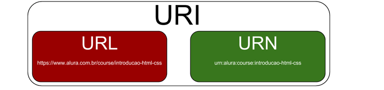

# Endereços sob seu domínio

- [Endereços sob seu domínio](#endereços-sob-seu-domínio)
  - [Por que não precisamos utilizar o caminho numérico para acessar os sites](#por-que-não-precisamos-utilizar-o-caminho-numérico-para-acessar-os-sites)
  - [Domínio](#domínio)
  - [Domínios e sub-domínios](#domínios-e-sub-domínios)
  - [Portas](#portas)
  - [Recursos](#recursos)
  - [Endereços](#endereços)
  - [Resumão](#resumão)
  - [URI / URL](#uri--url)

Domínio é um nome fácil de ser memorizado (ex: google.com), porém no mundo dos computadores, nós referenciamos as máquinas (servidores) por endereçamentos de IPs.

## Por que não precisamos utilizar o caminho numérico para acessar os sites

Por causa do **DNS**. O DNS é um serviço que resolve o nome de um domínio recebido pelo cliente e dá o endereço de IP de volta para o navegador poder fazer a requisição no servidor.

## Domínio

## Domínios e sub-domínios

## Portas

Os servidores web além de possuirem o domínio (endereço IP), também possui portas que podem ser acessadas **se estiverem abertas**. Geralmente a porta padrão para o **HTTP** é 80 e para **HTTPS** é 443.

`https://www.google.com:443`

## Recursos

## Endereços

## Resumão

## URI / URL

