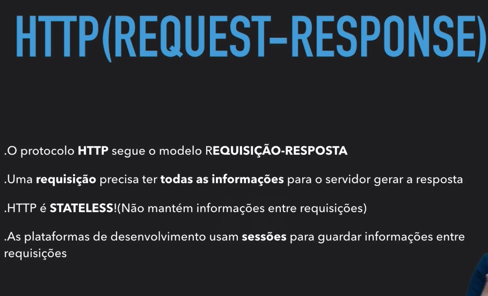

# O cliente pede e o servidor responte

- [O cliente pede e o servidor responte](#o-cliente-pede-e-o-servidor-responte)
  - [HTTP é stateless](#http-é-stateless)
  - [Como resolver o problema do HTTP stateless quando falamos de login / sessão (Spoiler: Cookies)](#como-resolver-o-problema-do-http-stateless-quando-falamos-de-login--sessão-spoiler-cookies)
  - [O que são cookies?](#o-que-são-cookies)
  - [Resumão](#resumão)

## HTTP é stateless

Quando uma requisição é processada, mesmo a subsequente seja exatamente igual, o HTTP não guarda essa informação, cada requisição é feita sem saber como a anterior foi efetuada.

## Como resolver o problema do HTTP stateless quando falamos de login / sessão (Spoiler: Cookies)

Quando o login é feito em um site qualquer, o servidor devolve para o navegador uma identificação informando que aquele usuário logado está validado para prosseguir para as próximas rotas, não precisando assim que o navegador fique enviando a cada rota acessada as credenciais informadas no login. Essa identificação é guardada por meio de **Cookies**.

## O que são cookies?

São pequenos arquivos de texto, que guardam informações sobre o usuário no navegador.

## Resumão

