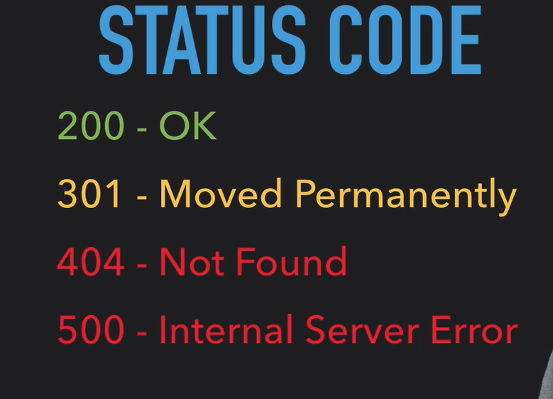
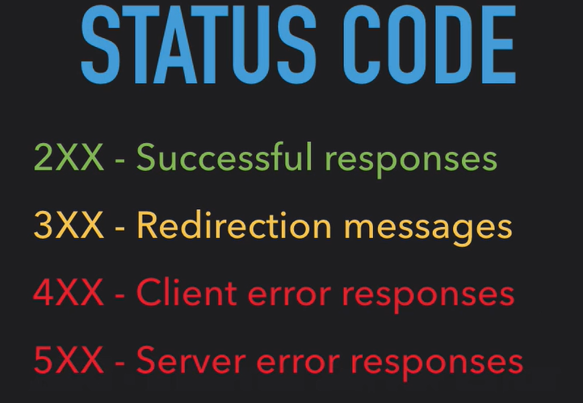

# Depurando a requisição HTTP

- [Depurando a requisição HTTP](#depurando-a-requisição-http)
  - [Status Codes das Requisições](#status-codes-das-requisições)
    - [Status Codes mais comuns](#status-codes-mais-comuns)
  - [Resumão](#resumão)

## Status Codes das Requisições

Para cada requisição que o navegador faz ao servidor, é retornado um response com o código de status da requisição, devolvendo para o cliente se ocorreu tudo corretamente ou não.

### Status Codes mais comuns

## Resumão

