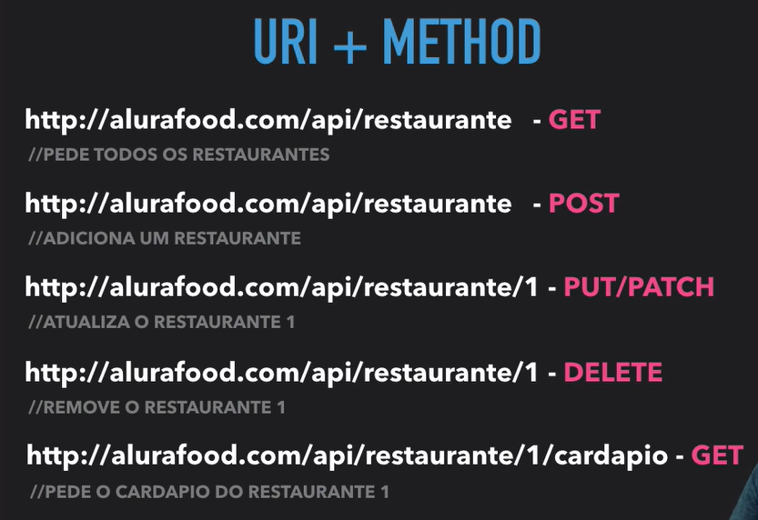
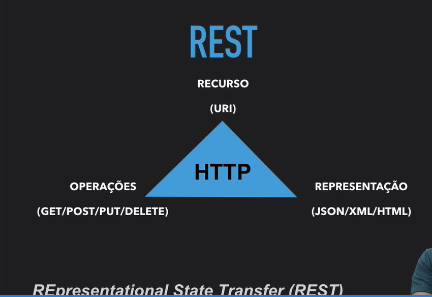
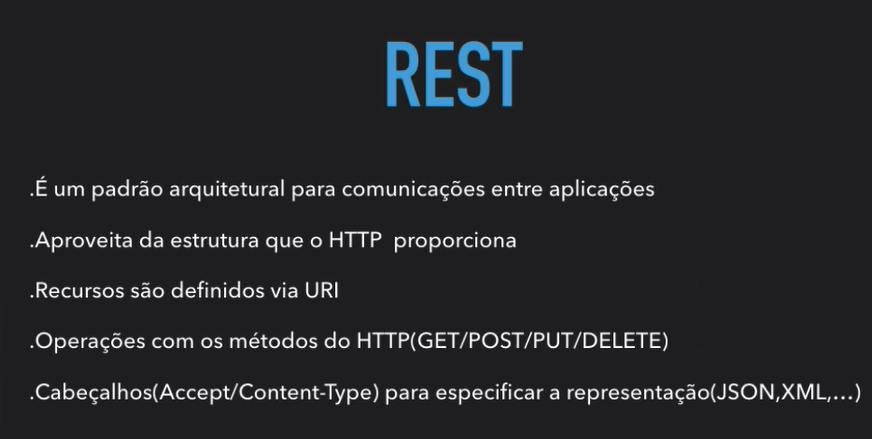

# Serviçoes na web com REST

- [Serviçoes na web com REST](#serviçoes-na-web-com-rest)
  - [O que é REST](#o-que-é-rest)
  - [MIME types](#mime-types)
  - [Resumão](#resumão)

## O que é REST

É basicamente unir o URI com o método da requisição. Trabalhar com a web com a maneira que ela especifica. É uma maneira de lidar com serviços Web da mesma forma que o HTTP foi proposto.

Mesmo que haja uma mesma URI se o método HTTP for diferente, a response será diferente com base no método HTTP.

Exemplo:

## MIME types

São os formatos de retorno de alguns cabeçalhos como `application/json`

## Resumão

