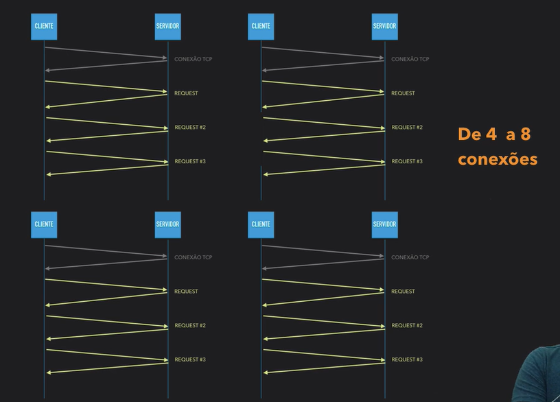
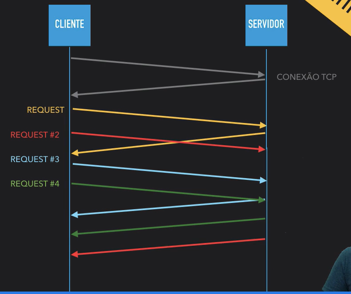

# HTTP2 por uma web mais eficiente

- [HTTP2 por uma web mais eficiente](#http2-por-uma-web-mais-eficiente)
  - [Especificações do HTTP2](#especificações-do-http2)
    - [Utilização de GZIP nas informações da requisição](#utilização-de-gzip-nas-informações-da-requisição)
    - [Envio dos textos em binário + HPACK + TLS e não mais em texto puro](#envio-dos-textos-em-binário--hpack--tls-e-não-mais-em-texto-puro)
      - [HPACK](#hpack)
      - [TLS](#tls)
  - [Não é preciso mais repetir os headers ou cabeçalhos enviados numa requisição passada](#não-é-preciso-mais-repetir-os-headers-ou-cabeçalhos-enviados-numa-requisição-passada)
  - [As requisições não retornam mais de forma serial (Server Push)](#as-requisições-não-retornam-mais-de-forma-serial-server-push)
  - [Multiplexação](#multiplexação)
  - [Resumão](#resumão)

## Especificações do HTTP2

### Utilização de GZIP nas informações da requisição

No HTTP2 a informações da requisição vem zipadas, por conta do tráfego ser mais rápido desta forma, devido a quantidade de aumento no tráfego de dados nos últimos tempos.

### Envio dos textos em binário + HPACK + TLS e não mais em texto puro

Requisição já sai do navegador com o tipo binário (ex: 010001010) e retorna (response) com o tipo binário também. Após serem convertipos pra binário, são comprimidos com HPACK e criptografados com TLS.

#### HPACK

O HPACK tem a função de comprimir mais ainda os binários retornados e enviados nos headers da requisição/response.

#### TLS

Criptografa os dados da request e response

## Não é preciso mais repetir os headers ou cabeçalhos enviados numa requisição passada

Quando os headers da requisição são os mesmos pra várias requisições, as informações são reaproveitadas e só hánovas requisições caso hajam cabeçalhos diferentes. Com esse reaproveitamento, o tráfego fica bem mais rápido.

## As requisições não retornam mais de forma serial (Server Push)

Ao ler o arquivo .html o HTTP2 já percebe os arquivos que são dependentes (.css, .js, etc) e já sabe o que ele tem que buscar, tornando o carregamento da página bem mais rápido.

Em outras palavras, o servidor faz a identificação e já envia alguns dados mesmo sem o browser ser pedido.

## Multiplexação

No HTTP 1.1 as requisições não são assíncronas, então pra que a próxima seja feita, tem que esperar a anterior finalizar. Antes de fazer uma requisição HTTP é feita uma conexão TCP, e pra que não tenha que ficar fechando e abrindo uma conexão TCP a cada requisição, o HTTP na versão 1.1 usa o mecanismo Keep-Alive, que mantém a conexão TCP ativa por um curto período de tempo. São abertas simultâneamente de 4 a 8 conexões TCP para que o carregamento fique dividido e não haja muita demora.

Exemplo na versão 1.1:

No HTTP2 as requisições são feitas de maneira assíncrona, então os retornos chegam de acordo com o que o servidor consegue ir processando.

Exemplo na versão 2:

## Resumão

